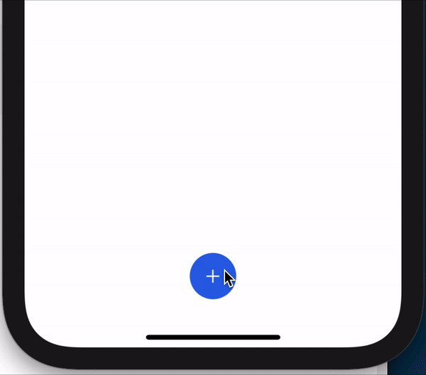

# FitnessPal Add Button
SwiftUI Add Button Animation inspired by FitnessPal app

# Menu
* [Preview](#preview)
* [To-Do](#to-do)
* [Source](#source)
* [Contributions](#contributions)
* [Contact](#contact)

# Preview

# To-Do
* Add background fade support for dark mode, currently background fade is only supported light mode

# Source
Code reference: [CodeSlicing](https://www.youtube.com/channel/UCakreohbcr3Xcrlc6qbbbVA)

# Contributions

* All kinds of contributions (enhancements, new features, documentation & code improvements, issues & bugs reporting & todo task) are welcome. Let's make it better.

# Contact
Created by [@ArgonYoYo](https://twitter.com/ArgonYoYo) - feel free to contact me!
